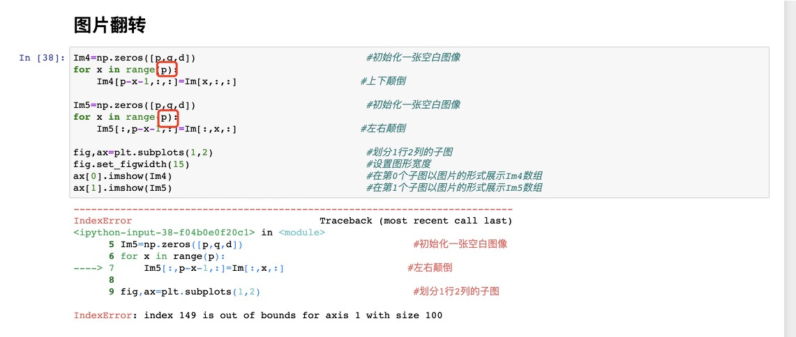

# 答疑

## 第1周

1. 豆子没了会怎么样？如何申请豆子？申请多少豆子？

> 在写作业的过程中请关注你的豆子是否快消耗光了，如果豆子消耗光了，那么机器会被自动释放，你写的代码可能还没保存，所以你得从头再来！所以请快消耗光豆子的时候艾特值班助教，让他/她帮你补充豆子。

> 豆子需要多少就申请多少，比如艾特助教后【我预计还需要1h，申请1颗豆子】。豆子不是无限量供应，请大家手下留情，及时释放机器。

> 当我们发现某同学是榨豆机（是其他同学平均消耗的2倍以上）的时候会停止给你发放本周的豆子（下周再给你发），那么可能得麻烦你自己解决（比如本地跑）

2. 为什么我在遍历图像时会出界？

> 注意图像是三阶张量，第一维是长度、第二维是宽度、第三维是颜色。在长宽不等时，遍历的总长度也应该不一样，所以这里第二块代码应该改为`range(q)`。

3. 为什么batchsize越大，epoch越小？

> 首先明确为何有batchsize：其实我们原本是运用全样本计算梯度进行优化，但当样本量过大时会导致内存不足等情况，我们才退而求其次地选择使用分割得到的小样本计算的梯度去替代全样本梯度。

> 因此batchsize越大，计算得到的梯度越接近全样本梯度，单次效果越好，从而需要的epoch数目应该越小。
